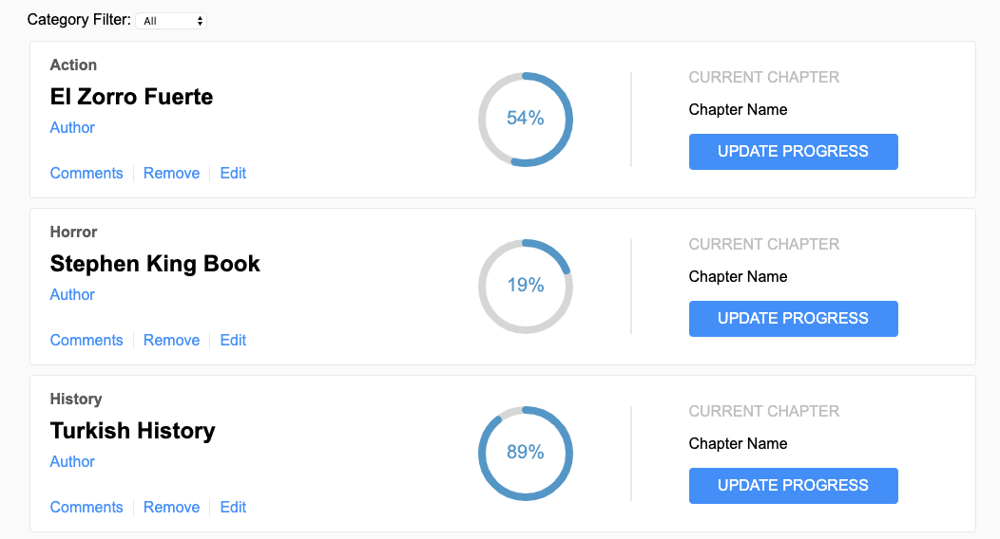

# React project: Bookstore CMS
CMS project with basic functionalies built with React&Redux



Authors: <a href="https://github.com/btuerker">Burhan Tuerker</a> / <a href="https://github.com/madcido">Fabio Carmo</a>

Live Preview: https://thawing-cove-34171.herokuapp.com/

## Installation Guide
### Prerequisities
System dependencies:
```
$ node -v
  v10.15.3

$ npm -v
  6.4.1

```

#### Local setup
##### Clone project
```
$ git clone https://github.com/btuerker/react-bookstore.git
$ cd ./react-bookstore
```
##### Install dependencies
```
$ npm install
```
##### Build project
```
$ npm run build
```
##### Running on development server
```
# npm start
```
Now you can visit localhost:3000 with your best browser.
